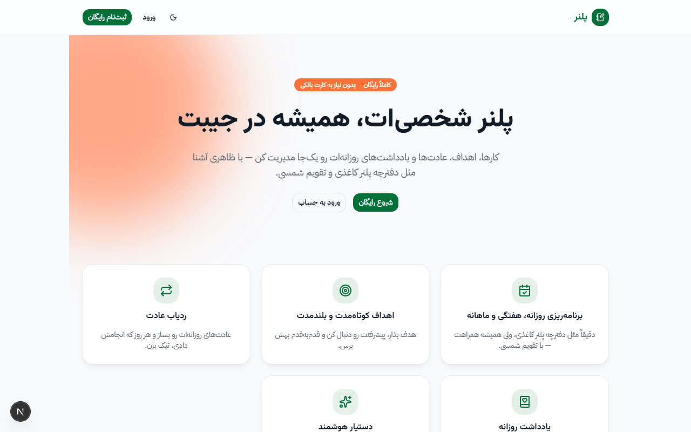
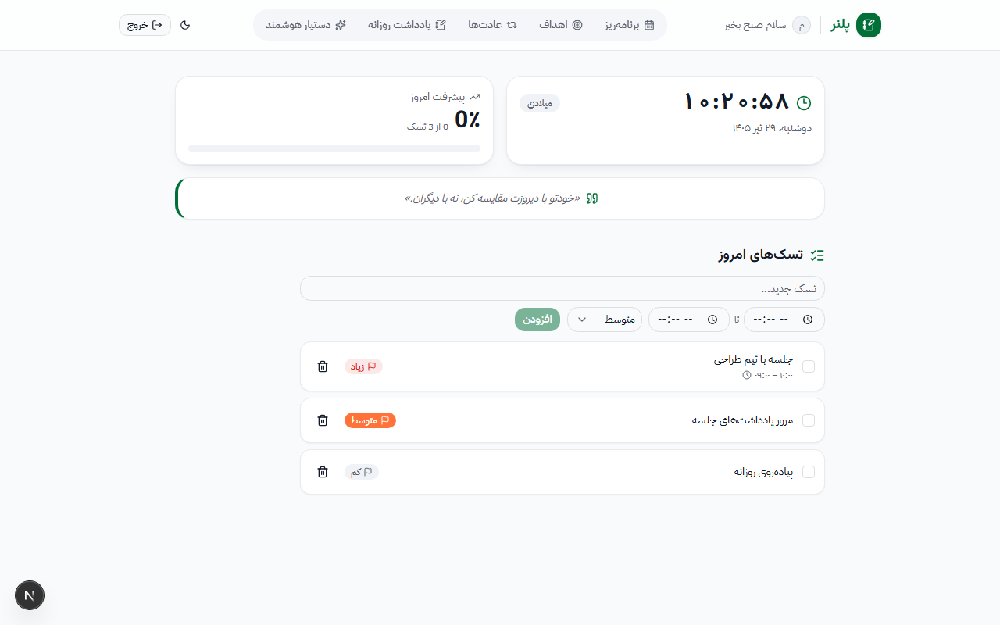
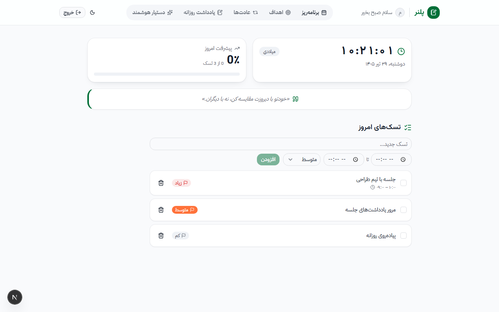
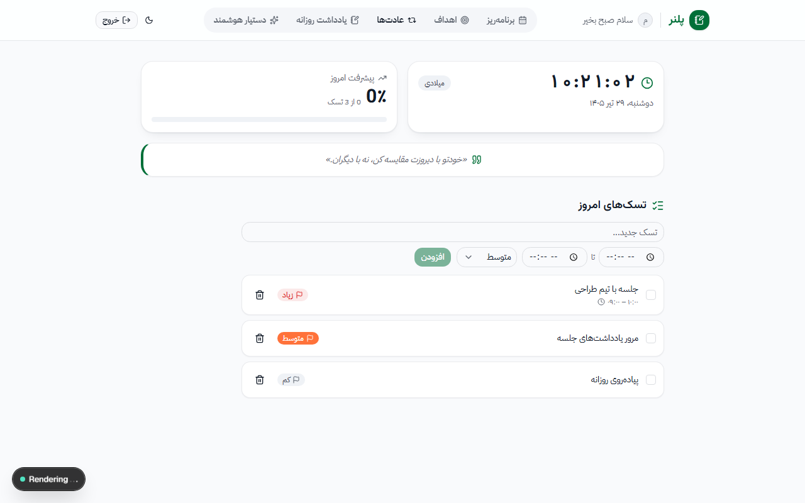

# پلنر — دیجیتال پلنر شخصی فارسی

یه پلنر دیجیتال شخصی، الهام‌گرفته از دفترچه‌های پلنر کاغذی: تسک روزانه/هفتگی/ماهانه با تقویم شمسی، اهداف، ردیاب عادت، یادداشت روزانه، و یه دستیار هوش مصنوعی که کارها رو برات مدیریت می‌کنه.

🔗 **دمو زنده:** [planner-vmdv-eight.vercel.app](https://planner-vmdv-eight.vercel.app)



## امکانات

- **برنامه‌ریزی روزانه/هفتگی/ماهانه** با تقویم شمسی کامل، اولویت‌بندی رنگی، بازه زمانی برای هر تسک، و جابه‌جایی تسک بین روزها با کشیدن-و-رهاکردن
- **اهداف** کوتاه‌مدت و بلندمدت با پیگیری درصد پیشرفت
- **ردیاب عادت** هفتگی با گرید چک‌باکسی
- **یادداشت روزانه** همراه با ثبت حالت روحی
- **دستیار هوش مصنوعی** (Gemini) که با شناخت از اهداف/عادت‌ها/برنامه‌ی واقعی کاربر صحبت می‌کنه، می‌تونه تسک/هدف/عادت بسازه یا تغییر بده، برای بازه‌های زمانی خالی برنامه پیشنهاد بده (با تأیید کاربر قبل از اعمال)، جستجوی وب انجام بده، و از طریق صدا هم قابل استفاده‌ست
- **یادآوری واقعی با Web Push** — حتی وقتی اپ بسته باشه، ۱۰ دقیقه قبل از هر تسک نوتیفیکیشن می‌فرسته
- **پنل مدیریت** برای دیدن و مدیریت کاربران ثبت‌نامی
- **فراموشی رمز عبور** با تأیید مالکیت ایمیل (لینک بازیابی زمان‌دار)
- **PWA** کامل — قابل نصب روی موبایل/دسکتاپ، پوسته آفلاین
- حالت روشن/تاریک

## اسکرین‌شات‌ها

| داشبورد | برنامه‌ریز هفتگی |
|---|---|
|  |  |

| اهداف | عادت‌ها |
|---|---|
|  |  |

| دستیار هوش مصنوعی |
|---|
|  |

## پشته فنی

| بخش | تکنولوژی |
|---|---|
| فریم‌ورک | [Next.js 16](https://nextjs.org) (App Router, Turbopack), TypeScript |
| ظاهر | Tailwind CSS v4, کامپوننت‌های shadcn-style روی [Base UI](https://base-ui.com) |
| دیتابیس/ORM | PostgreSQL ([Neon](https://neon.tech)) + [Prisma 7](https://www.prisma.io) |
| احراز هویت | سشن سفارشی با JWT ([jose](https://github.com/panva/jose)) — بدون NextAuth |
| هوش مصنوعی | [Gemini API](https://ai.google.dev) با function calling، grounding با جستجوی وب |
| ایمیل | Nodemailer روی Gmail SMTP |
| نوتیفیکیشن | Web Push API + [web-push](https://github.com/web-push-libs/web-push) با کلیدهای VAPID |
| تقویم شمسی | [jalaali-js](https://github.com/jalaali/jalaali-js) |
| میزبانی | [Vercel](https://vercel.com) |

## اجرای محلی

```bash
npm install
cp .env.example .env   # مقادیر واقعی رو پر کن
npx prisma migrate dev
npm run dev
```

متغیرهای محیطی لازم:

```
DATABASE_URL=              # اتصال Postgres (مثلاً از Neon)
SESSION_SECRET=            # یه رشته تصادفی برای امضای سشن
GEMINI_API_KEY=            # کلید رایگان از aistudio.google.com
GMAIL_USER=                # ایمیل جیمیل برای ارسال لینک بازیابی رمز
GMAIL_APP_PASSWORD=        # App Password جیمیل (نه رمز اصلی حساب)
NEXT_PUBLIC_VAPID_PUBLIC_KEY=
VAPID_PRIVATE_KEY=         # با web-push.generateVAPIDKeys() ساخته می‌شه
VAPID_SUBJECT=             # مثلاً mailto:you@example.com
CRON_SECRET=               # هر رشته تصادفی، برای محافظت از /api/cron/reminders
```

برای یادآوری تسک‌ها، یه سرویس رایگان زمان‌بند بیرونی (مثل [cron-job.org](https://cron-job.org)) باید هر ۱ دقیقه آدرس `/api/cron/reminders?secret=<CRON_SECRET>` رو صدا بزنه — چون سرورلس Vercel به‌تنهایی زمان‌بند لحظه‌ای نداره.
